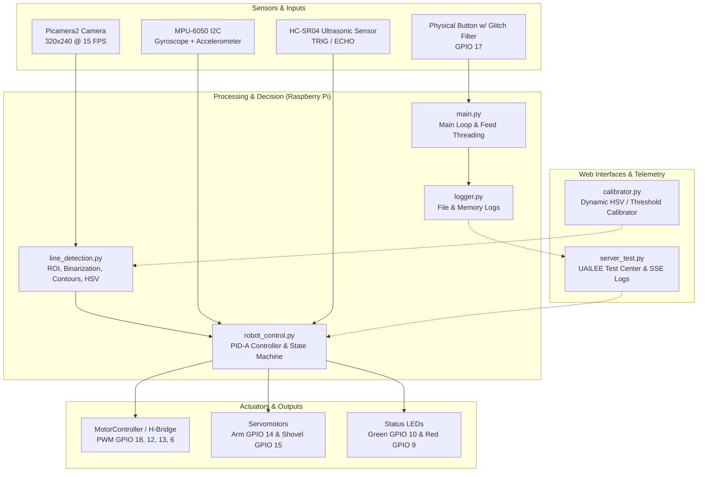

# 🤖 OBR 2025 — Autonomous Rescue Robot (Team UAILEE)

[](https://www.python.org/)
[](https://www.raspberrypi.com/)
[](https://opencv.org/)
[](https://flask.palletsprojects.com/)
[](http://www.obr.org.br/)

Official development repository for the autonomous robot **UAILEE**, designed and built to compete in the **Brazilian Robotics Olympiad (OBR 2025)** in the **Rescue** category.

The project integrates real-time embedded computer vision, inertial sensor fusion (IMU), dynamic PID control with angular compensation, a finite-state machine for complex maneuvers, and web servers for telemetry and remote sensor calibration.

---

## 🏆 Achieved Results

During official arena runs and track validations in Stage 1 of OBR 2025, the **UAILEE** robot achieved high-performance results:

* 🎯 **Official Arena Score:** **115 POINTS** earned on the Stage 1 competition track.
* 🛣️ **Robust Line Following (PID-A):** Continuous stability on straight paths and smooth curves at constant speed, mitigating oscillations by combining line position error and line vector angular error.
* 🟢 **Intersection Detection & Handling (Green Markers):**
  * 90° left and right turns with a 100% success rate in testing.
  * **Dead End** detection (2 simultaneous green markers) with autonomous and precise 180° rotation, returning along the same track.
* 🚧 **Autonomous Obstacle Avoidance:** Early obstacle detection via the front ultrasonic sensor (< 10 cm) and full detour maneuver guided by odometry and gyroscope, automatically realigning with the black line.
* 📐 **Intelligent Ramp Traversal:** Real-time arena slope detection via accelerometer ($\ge 10^\circ$), boosting PWM to $220$ uphill (overcoming gravity) and decelerating to $80$ downhill (preventing wheel slip).
* 🔄 **Line Self-Recovery System:** Smart three-phase search routine (short reverse, right sweep, and wide left turn) that recovers the robot in case of sudden line departure or track discontinuities.
* 🛑 **Stop at Red Line:** Instant visual recognition of the red marker and accurate stopping at the end of the course.
* 🌐 **Wireless Remote Calibration:** Arena calibration time reduced from minutes to seconds using the Flask web dashboard and real-time HSV mask streaming over Wi-Fi on the Raspberry Pi.

---

## 📐 System Architecture



---

## 🛠️ Hardware & Electronics

| Component | Model / Specification | Robot Function |
| :--- | :--- | :--- |
| **Main Controller** | Raspberry Pi (Linux) | Central processing, computer vision, and peripheral control |
| **Camera** | Raspberry Pi Camera Module (Picamera2) | Continuous video capture of the track and rescue area (320x240 px) |
| **IMU (Gyroscope + Accelerometer)** | MPU-6050 (I2C communication, 0x68) | Ramp slope measurement and Z-axis angular integration for 90° and 180° turns |
| **Distance Sensor** | Ultrasonic HC-SR04 | Front distance readings in centimeters for obstacle avoidance |
| **Drive Motors** | DC gearmotors | Differential drive chassis |
| **Motor Driver** | H-Bridge (hardware PWM controlled) | Direction and speed control for left and right motors |
| **Servomotors** | Micro Servos 9g / standard | Movement of the shovel and collector arm for the Rescue Area |
| **Status LEDs** | Diffuse Green and Red LEDs | Visual feedback for startup, line loss, dead ends, and rescue area |
| **Control Button** | Push-button with pull-up resistor | Toggle start and immediate stop of the robot |

### GPIO Pin Mapping (`hardware_setup.py`)

| Peripheral / Signal | GPIO Pin (BCM) | Direction | Description |
| :--- | :---: | :---: | :--- |
| `MOTOR_LEFT_CLKWISE` | **18** | Output | Left motor PWM (clockwise) |
| `MOTOR_LEFT_ANTI` | **12** | Output | Left motor PWM (counter-clockwise) |
| `MOTOR_RIGHT_CLKWISE` | **13** | Output | Right motor PWM (clockwise) |
| `MOTOR_RIGHT_ANTI` | **6** | Output | Right motor PWM (counter-clockwise) |
| `TRIG` | **24** | Output | Ultrasonic trigger pulse (10 µs) |
| `ECHO` | **23** | Input | Ultrasonic echo return |
| `servo_arm` | **14** | Output | Arm servo PWM signal |
| `servo_shovel` | **15** | Output | Shovel servo PWM signal |
| `BTN_PIN` | **17** | Input | Control button (PUD_UP, 5000 µs glitch filter) |
| `green_led` | **10** | Output | Green status LED |
| `red_led` | **9** | Output | Red status / alert LED |
| `MPU-6050 (SDA/SCL)` | **2 / 3** | I2C | Raspberry Pi default I2C bus |

---

## 💻 Software Architecture and Algorithms

### 1. Computer Vision (`line_detection.py`)
* **Region of Interest (ROI) Extraction:** The raw 320x240 pixel frame is cropped to the bottom-central half to eliminate irrelevant elements outside the track and focus strictly on the line.
* **Processing and Binarization:**
  1. BGR to grayscale conversion (`cv2.cvtColor`).
  2. Inverted binarization with a calibrated threshold (`cv2.threshold` with `threshold_value = 45`).
  3. Morphological operations with a $5\times 5$ kernel: closing (`cv2.morphologyEx` with `MORPH_CLOSE`) to seal tape discontinuities, followed by opening (`MORPH_OPEN`) to filter noise.
* **Dual Error Calculation:**
  * **Position Error ($P$):** Using first-order spatial moments of the line contour ($C_x = \frac{m_{10}}{m_{00}}$), computes pixel deviation from the horizontal center of the camera.
  * **Angular Error ($A$):** Applies `cv2.fitLine` to the contour to extract the direction vector $(v_x, v_y)$ and calculate the line's angle relative to the vertical axis ($\text{degrees} = \arctan2(v_x, v_y) \cdot \frac{180}{\pi}$).
* **HSV Color Identification (`identify_colour`):**
  * Segmentation across Hue (H), Saturation (S), and Value (V) channels using dynamic windows and `COLOR_OFFSET`.
  * **Green:** Detects green intersection markers. If 2 or more contours have area $> \text{MIN\_AREA\_GREEN}$, it signals a `DEAD_END`; if 1, it checks whether its centroid is to the left or right of the image center.
  * **Red:** Detects the final stopping line.
  * **Gray:** Identifies the entrance tile to the Rescue Area.

### 2. Control and Navigation (`robot_control.py`)
* **Extended PID-A Controller:**
  $$PID = (K_p \cdot P) + (K_i \cdot I) + (K_d \cdot D) + K_a \cdot A$$
  * $K_p = 4.0$: Proportional action on position deviation.
  * $K_i = 0.0$: Integral action with anti-windup (reset upon error sign changes).
  * $K_d = 0.0$: Derivative action on error rate of change.
  * $K_a = 0.1$: Anticipatory angular action, correcting trajectory ahead of sharp turns.
* **Differential Motor Adjustment:**
  $$V_{\text{right}} = \text{clamp}(V_{\text{base}} - PID, 0, 255)$$
  $$V_{\text{left}} = \text{clamp}(V_{\text{base}} + PID, 0, 255)$$
* **Gyroscope and Bias Calibration:**
  * The MPU-6050 gyroscope is calibrated at rest across 200 samples (`calibrate_gyro`). The `turn_until_angle` function integrates $\Delta t \cdot (\omega_z - \text{bias}_z)$ for precise 90° and 180° rotations.
* **Dynamic Ramp Compensation:**
  * Slope estimation via $\arctan2(a_y, a_z)$. If $\text{slope} \ge 10^\circ$, it engages climbing power ($V = 220$). If $\le -10^\circ$, it drops speed to $V = 80$.
* **Obstacle Avoidance:**
  * Autonomous sequence: Stop $\to$ 90° Left Turn $\to$ Forward $\to$ 90° Right Turn $\to$ Forward $\to$ 90° Right Turn $\to$ Forward $\to$ 90° Left Turn $\to$ Search and re-acquisition of the line.

### 3. Victim Detection in Rescue Area (`ball_detection.py`)
* Geometric circle detection using the **Hough Circle Transform** (`cv2.HoughCircles`).
* Application of circular masks to compute mean HSV color, classifying victims into alive (silver/gray) or dead (black) for transport to the evacuation zone.

---

## 🌐 Web Interfaces & Telemetry

### 1. Real-time Calibrator (`calibrator.py`)
Flask server (`http://<raspberry_pi_ip>:5000`) built to streamline arena adjustments during competition:
* **MJPEG Streaming:** Live camera view with overlay of contours and color-coded bounding boxes.
* **Mask Previews:** Dedicated feeds to inspect the binary line image (`/processed_feed/threshold`) as well as individual masks for Green, Red, and Gray.
* **Interactive HSV Sampler:** Click or send coordinates of a region (ROI) to read mean HSV values directly from the arena lighting.
* **Dynamic Tuning:** Sliders to adjust threshold levels and HSV bounds in real time without restarting the script.

### 2. UAILEE Test Center (`server_test.py`)
Unified dashboard for operational control and robot diagnostics:
* **Remote Commands:** `Start` and `Stop` buttons that launch/stop an asynchronous control thread.
* **Parameter Fine-Tuning:** Sliders for $K_p, K_i, K_d, K_a$, and threshold.
* **System Telemetry:** Continuous monitoring of CPU load, RAM usage, CPU temperature (`/sys/class/thermal/thermal_zone0/temp`), and power under-voltage/throttling status (`vcgencmd get_throttled`).
* **Live SSE Log Console:** Web-based terminal receiving real-time log messages via Server-Sent Events.

---

## 📁 Project Directory Structure

```
OBR2025/
├── constants.py           # Definition of constants, speeds, pinout, and PID parameters
├── hardware_setup.py      # Initialization of GPIO, pigpio, sensors (MPU-6050, HC-SR04), and LEDs
├── motors.py              # MotorController class for DC motor PWM driving
├── line_detection.py      # Computer vision algorithms (line, curves, and HSV markers)
├── ball_detection.py      # Sphere detection using Hough Circles and victim classification
├── robot_control.py       # PID control, special maneuvers (obstacles, dead ends, ramps, turns)
├── main.py                # Main entry point for autonomous robot operation
├── calibrator.py          # Flask server for real-time computer vision and HSV calibration
├── server_test.py         # "UAILEE Test Center" web dashboard with telemetry and SSE
├── logger.py              # Thread-safe logging module with disk persistence
├── teste.py               # Bench test script for individual actuators and sensors
├── testecam.py            # Quick validation script for Picamera2 capture
├── datas/                 # Captured image dataset for bench testing
│   ├── lines/             # Turn, intersection, and track tile samples
│   ├── balls/             # Rescue ball test images
│   └── reliefs/           # Obstacle and terrain relief test images
├── logs/                  # Real-time execution text logs
├── pdfs/                  # Technical documentation and exported Jupyter notebooks
│   ├── notebooks/         # Computer vision modeling notebooks (.ipynb)
│   ├── code-documentation.pdf
│   ├── eletronic-documentation.pdf
│   ├── line-detection.pdf
│   └── model-to-detect-balls.pdf
├── static/                # CSS and JavaScript assets for Flask web dashboards
└── templates/             # HTML templates (index.html and calibrator.html)
```

---

## 🚀 How to Run the Project

### Prerequisites
On the Raspberry Pi running Raspberry Pi OS (Linux):
```bash
# Install system and Python dependencies
sudo apt-get update
sudo apt-get install python3-pip pigpio python3-pigpio python3-opencv

# Install required Python packages
pip3 install flask picamera2 mpu6050-raspberrypi psutil numpy
```

### 1. Start the GPIO Daemon (`pigpiod`)
Hardware PWM for motors and servos requires the `pigpio` daemon:
```bash
sudo pigpiod
```

### 2. Run the Robot in Autonomous Mode
To run the competition routine directly on the robot using the physical start button:
```bash
python3 main.py
```
> The robot will initialize the camera and calibrate the gyroscope (keep the robot stationary for ~2 seconds). When the push-button (GPIO 17) is pressed, the green LED will blink and autonomous navigation will begin.

### 3. Run the Calibration Server
To calibrate curve colors and line threshold under competition arena lighting:
```bash
python3 calibrator.py
```
Access via computer or mobile browser on the same Wi-Fi network: `http://<RASPBERRY_PI_IP>:5000`

### 4. Run the Test Center and Telemetry Dashboard
To monitor telemetry, adjust PID gains, and operate the robot remotely:
```bash
python3 server_test.py
```
Access: `http://<RASPBERRY_PI_IP>:5000`

---

## 👥 Team & Authors

Project developed for **OBR 2025**:
* **Lucas Lemos Ricaldoni** ([@lemosslucas](https://github.com/lemosslucas))
* **Mateus Pedrosa** ([@mateusdcp13](https://github.com/mateusdcp13))
* **Equipe UAILEE**
